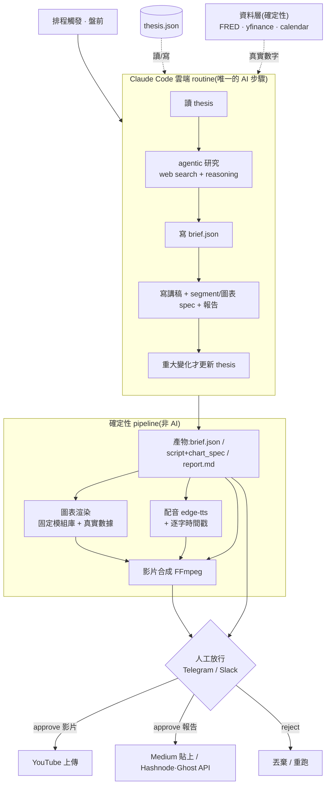

# 美股盤前總經自動影片系統 — 系統計劃書

> 工作代號:**PMB(Pre-Market Macro Brief)**
> 目標:每個交易日盤前自動研判美股市場狀況(各大指數、總經、槓桿),產出**一支公開的 30 秒說明影片**(YouTube)與**一份當日研究報告**(發布平台)。
> **受眾是一般大眾,內容以「對最多人最有價值」為準,與作者個人 portfolio 脫鉤。**
> 文件版本:v3 草案

---

## 1. 概觀

每個交易日盤前跑一次,做一次研究、出兩種產出:30 秒影片(YouTube)+ 當日研究報告(長文)。兩者是**同一次研究的兩種 renderer**。

**編輯定位(v3 核心修正):** 這是公開內容,目標是幫助最多人,不是服務作者自己的投資。作者挑了主題(指數、總經、槓桿),但**所有判斷、選圖、語氣都要以「對廣大觀眾最有價值」為準**,而不是以作者用的工具或部位出發。槓桿以**資訊性與風險素養**角度呈現(這種市場 regime 下槓桿如何表現、為何高風險),**不做成可跟單的策略**。

兩個核心張力:
1. 它是日更短片,但偶爾「當天盤面消息本身就是長期訊號」,系統必須抓得到、講得出來,不被日更慣性壓平。
2. 外面每天的盤前內容多如牛毛;要真的幫到人,門檻是「比雜訊更清楚、更誠實、圖更好懂」,而非只是把流程跑通。

聚焦標的:指數(S&P 500、Nasdaq、Dow、Russell 2000)+ VIX、10Y 殖利率、美元指數;槓桿載具(UPRO/TQQQ/TMF/SOXL 等)作為市場資訊與風險教育素材。

---

## 2. 系統架構

兩個 LLM 步驟(研究 + 文字生成)合併進**同一個 Claude Code 雲端 routine**;確定性階段(渲染/合成/上傳)留在 agent 之外。



---

## 3. 核心設計原則

1. **數字走 API,LLM 只負責綜述。** 具體數字一律來自 FRED/yfinance,絕不讓 LLM 生成。
2. **研究與機械分離。** 只有研判與文字生成用 agentic Claude;取數、畫圖、配音、合成、上傳是確定性流程。
3. **兩個 LLM 步合一。** 研究 + 寫 brief + 寫稿/選圖 + 寫報告 + 更新 thesis,全在同一個 routine 的一次 run(同 context、無交接損失)。
4. **為最多人最大價值,與個人 portfolio 脫鉤。** 判斷、選圖、語氣以廣大觀眾為準;槓桿走資訊/風險教育,非可跟單策略;語氣教育而非建議。
5. **「發生什麼」與「動不動長期」是兩層。** 資訊蒐集框在近 12–24 小時,但每天獨立評估中長期影響。
6. **依重要性浮動配時。** 30 秒不切死;`lead_horizon` 決定當天時間分配。
7. **圖隨盤勢、與稿同源。** 圖表由寫稿那一步從固定模組庫選出,與講稿同一份結構化輸出。

---

## 4. 階段一:資料層(確定性)

全免費,供應可信數字。

- **FRED API**:CPI、PCE、失業率、payrolls、GDP、Fed funds rate、殖利率曲線(DGS10/DGS2/T10Y2Y)。
- **yfinance**:指數期貨(ES=F/NQ=F/YM=F/RTY=F)、VIX、^TNX、美元指數、TLT;槓桿載具(UPRO/SPXL/TQQQ/UDOW/TNA/SOXL/TMF)。
- **衍生指標(自算)**:股債滾動相關性、已實現波動率、市場廣度——作為市場 regime 的輸入(對所有觀眾有意義,不只槓桿持有者)。
- **market calendar**:`pandas_market_calendars`,休市日整條 skip。

---

## 5. 階段二:研究與文字生成(唯一的 AI 步驟)

### 5.1 工具:單一 Claude Code 雲端 routine

主選 **Claude Code 雲端排程 routine**:跑在 Anthropic 雲端,電腦關機也照跑,可被 API/GitHub event 觸發;是 agentic Claude(web search + thinking + 工具);你重度使用,零學習成本。一次 run 完成研究 + brief + 講稿/圖表 spec + 報告 + thesis 更新。

替代(視需求):Perplexity Sonar Pro + Pro Search(日更最省,<$1/月);o4-mini-deep-research / sonar-deep-research(週更深挖)。日更用中等深度 agentic pass。

### 5.2 滾動 thesis(以「市場 regime」為主,非個人部位)

維護 `thesis.json`,記錄當前市場基準情境。每日:**讀 thesis → 研究 → 評估 delta → 重大變化才更新 → 產出帶 horizon 標籤的 brief**。

追蹤的 regime(框成市場狀態,給所有觀眾):
- 指數趨勢與位置、Fed/通膨/利率 backdrop
- 波動 regime(VIX/已實現波動)——也用來解釋槓桿產品為何在此環境風險升高
- 股債相關性、市場廣度

### 5.3 materiality 三層判斷

每條打 `horizon`(ST/MT/LT)、`vs_thesis`(confirms/challenges/new)、`confidence`(confirmed/developing/single-print)。

觸發「中長期」旗標:Fed 政策 regime、通膨趨勢斷裂、勞動市場 regime、利率/曲線結構、信用/金融穩定事件、財政與債務、地緣與貿易 regime、結構性盈利/AI capex 拐點;以及對廣大投資人重要的波動跳升、股債相關性破裂、利率衝擊(同時用作槓桿風險教育的切入點)。

### 5.4 confidence 與「先 flag、後更新」

更新 thesis 要保守(確認才改基準);產出可先 flag 未確認的重大發展,語氣對應 confidence(「若延續,可能…」)。

### 5.5 horizon-aware 去重

短期狠狠去重;中長期當 open threads 追蹤,不因「昨天提過」蓋掉長期訊號。

### 5.6 文字生成(同一步)

同一個 routine 在研究後直接輸出:
- **講稿 + segment/圖表 spec**(見 §7)
- **長文報告**(見 §8)
- **反 AI 腔(寫進 prompt)**:自然口語/書面、有個性,不用「不是…而是」「值得注意的是」等套話,少清單腔、避免空洞對比;報告是長文,最該嚴格套用。
- **編輯約束(寫進 prompt)**:以最廣價值為目標,與任何特定 portfolio/產品脫鉤,語氣教育而非建議。

### 5.7 brief schema

```json
{
  "date": "2026-06-19",
  "indices": [{ "name": "S&P 500", "level": 0, "overnight_pct": 0, "drivers": [] }],
  "leverage_context": [{ "market": "S&P 500", "edu_note": "當前波動下維持一般股市風險的曝險約 1x;固定高槓桿的波動耗損隨倍數平方放大" }],
  "// leverage_math(數值,放快照層)": "每指數:realized_vol / vol_target_leverage(=參考風險/波動) / drag_1x,2x,3x(≈L²σ²/2)",
  "regime": { "vol": "elevated", "rates": "rising", "stock_bond_corr": "positive", "breadth": "narrow" },
  "items": [{
    "headline": "...", "horizon": "LT", "vs_thesis": "challenges",
    "materiality": 4, "confidence": "single-print",
    "audience_value": "說明這對一般投資人代表什麼",
    "sources": [{ "url": "...", "ts": "2026-06-19T03:12:00Z" }]
  }],
  "thesis_delta": { "changed": true, "summary": "...", "horizon": "MT" },
  "lead_horizon": "MT"
}
```

---

## 6. 階段三:圖表 — 隨盤勢出圖、與講稿對齊

對齊與「不要每天一樣的圖」由同一機制解決:**寫稿那一步同時輸出講稿 + 結構化圖表 spec。**

### 6.1 圖表模組庫(parameterized renderers)

`index_overnight_grid`(四大指數隔夜)、`yield_curve`(2s10s)、`vix_regime`(VIX 對區間 + 門檻帶)、`rates_trend`(10Y 趨勢)、`stock_bond_corr`(股債相關)、`breadth`(廣度/輪動)、`econ_print`(總經序列 highlight 最新數據)、`leverage_decay`(同一波動下槓桿 vs 標的的耗損示意,風險教育用)。

### 6.2 選圖:LLM 從固定選單挑,程式驗證 + 渲染

寫稿時 LLM 依當天 driver 從**封閉清單**選 3–5 個模組 + 參數;程式端驗證並用**真實數據**渲染。多樣性來自 driver 不同→組合不同 + 數據天天變;可靠性來自 LLM 不能發明圖表類型、不能編數字。**選圖以「幫最多人理解」為準**,槓桿圖情境性出現。

### 6.3 對齊:結構性綁定

講稿與圖表 spec 同源,每個 segment 綁一個 `chart_id`,合成時在該段旁白期間顯示對應圖;段內精確時間用 edge-tts 逐字時間戳。

```json
{
  "segments": [
    {"vo": "隔夜四大指數收紅,費半領漲...", "chart_id": "idx_grid",   "t_start": 0, "duration": 6},
    {"vo": "VIX 跳上 22,風險偏好轉弱...", "chart_id": "vix_regime", "t_start": 6, "duration": 9}
  ],
  "charts": [
    {"id": "idx_grid",   "module": "index_overnight_grid", "params": {"tickers": ["ES=F","NQ=F","YM=F","RTY=F"]}},
    {"id": "vix_regime", "module": "vix_regime",           "params": {"lookback_days": 60, "bands": [15,20,30]}}
  ]
}
```

防重複:記錄近幾天用過的模組,故事允許時偏向沒用過的。**排除 AI 影片生成(Veo/Sora/Kling)** — 生不出正確金融圖表。

---

## 7. 階段四:當日研究報告與發布

### 7.1 報告內容(brief 的完整版,面向一般讀者)

同一份 `brief.json` 展開成長文,以「對一般投資人有用」為主軸:整體盤勢 → 各大指數 → 市場 regime(波動、利率、廣度)→ 完整 item 帶 confidence 與「對一般人代表什麼」→ thesis 與當日 delta → 今日催化劑 → 來源。槓桿以風險教育切入,非策略。圖表可重用影片的。

### 7.2 發布:Medium 已封 API

Medium 不再發新 integration token、不接受新整合,新接拿不到 token。兩條路:
- **要上 Medium → 產草稿 + 人工貼上(建議)**:生成排版好的 markdown,review 後貼上(或自架網址用 import-by-URL)。與影片 human gate 一致,且每天自動發市場評論的合規風險對券商身分較高,人工放行較穩。
- **要全自動 → 發 Hashnode/Ghost/自架靜態站**(有 API),Medium 當手動 canonical 轉貼。

---

## 8. AI 使用地圖

AI 只集中在**一個** Claude Code routine(研究 + 講稿 + 報告 + 選圖)+ 配音的神經語音;其餘刻意走確定性流程。

| 階段 | AI? | 工具 | 月費(~21次) |
|---|---|---|---|
| 排程觸發 | ✗ | Claude Code routine 排程 / cron | $0 |
| 資料蒐集(數字) | ✗ | FRED / yfinance | $0 |
| **研究 + 講稿 + 報告 + 選圖** | ✓ 核心(單一步驟) | **Claude Code 雲端 routine** | 折進方案 ~$0 |
| 圖表渲染 | ✗ | matplotlib / mplfinance | $0 |
| 配音 | ✓(神經語音) | edge-tts | $0 |
| 影片合成 | ✗ | MoviePy / FFmpeg | $0 |
| 發布/上傳 | ✗ | YouTube API / 貼文 | $0 |

總 AI 成本由 routine 所在的 Claude 方案決定;CP 路線約 **$0–2/月**。

---

## 9. 階段五~八:配音 / 合成 / 上傳 / 排程

- **配音**:edge-tts(免費、zh-TW、逐字時間戳→字幕);走非官方 endpoint,需 fallback(OpenAI TTS / ElevenLabs)。
- **影片合成**:MoviePy/FFmpeg(圖表 PNG 轉場 + 燒字幕 + 配音軌)。選配 Remotion。
- **上傳**:YouTube Data API v3(免費額度內,需 OAuth + refresh token),描述帶免責聲明。
- **排程**:Claude Code 雲端 routine 盤前觸發(ET 7–8 點 = 台灣傍晚/晚上,不依賴本機);休市日 skip;任何階段失敗主動通知。

---

## 10. 成本

| 路線 | routine 所在方案 | TTS | 其餘 | 月費 |
|---|---|---|---|---|
| **最省** | 已有的 Claude 方案 / Perplexity Pro Search | edge-tts $0 | $0 | **~$0–2** |
| **均衡** | Claude 方案 | edge-tts $0 | $0 | **<$5** |
| **高質感** | + 週更 deep research | ElevenLabs $5/月 | Remotion(免費) | **~$10–30** |

真正成本是開發/維護時間與免費 endpoint 的可靠度風險。

---

## 11. 合規與風險(公開 + 券商身分,務必先處理)

- **公司政策預檢**:員工對外發布市場評論、個人帳戶交易通常有 pre-clearance/申報規範。上線前先確認 GoodFinance 政策。
- **公開受眾 + 槓桿 = 高敏感**:槓桿/反向 ETF 對散戶風險高。內容停在**資訊與風險教育**,不做策略推薦;免責聲明對槓桿內容尤其顯著。
- **與個人 portfolio 脫鉤**:不暗示作者部位、不做可跟單訊號。
- **MNPI / connector scoping**:研究 routine 只用 web search,不掛工作的 Drive/Slack。
- **人工放行 gate**:影片與報告上線前都過;報告建議走 review-and-paste。
- **免責聲明**:影片、報告、描述固定帶「非投資建議」。
- **事實正確性**:數字走 API,語氣對應 confidence。
- **endpoint 脆弱性**:edge-tts、search rate limit 包 retry + fallback。

---

## 12. 可行性與風險評估(誠實版)

拆三層看,結論不一樣:

**(A) 能串成 end-to-end pipeline?機率很高(~90%+)。** 元件全是成熟技術(FRED/yfinance、matplotlib、edge-tts、FFmpeg、YouTube API),Claude routine 是現成功能,沒有 exotic 的東西。幾個週末可達成。

**(B) 無人值守、每交易日穩定三個月不用碰?中等,需維護。** 壞點在小地方:yfinance 被 Yahoo 改壞/限流、edge-tts 非官方 endpoint 會斷、LLM 偶爾吐壞 JSON、雲端 routine 排程邊角、YouTube 偶發錯誤。單獨機率不高,乘起來頭一個月會一直補。靠監控 + fallback + human gate 優雅吸收。

**(C) 每天的研究判斷夠好到值得公開發、真的幫到人?這是真正的不確定,且非工程問題。** 機制健全,但要產出「不空泛、triage 正確、天天不重複」的判斷,需頭 1–2 週調 prompt 與選圖;目標是「幫最多人」,門檻是比外面一堆盤前內容更清楚誠實。pipeline 讓你能做到,不保證做到。

**逐元件信心:**

| 元件 | 信心 | 主要風險 / 緩解 |
|---|---|---|
| 資料層 | 很高 | yfinance 偶爾壞;retry/快取或付費資料源 fallback |
| 研究 routine 執行 | 高 | 新功能,需驗證排程可靠度;先觀察 |
| 研究判斷品質 | 中(關鍵變數) | 空泛/重複;靠 burn-in 調 prompt + human gate |
| 結構化輸出(JSON/選圖) | 高 | 偶發 malformed;schema 驗證 + 重試 |
| 圖表渲染 | 很高 | 純工程,無風險 |
| TTS + 字幕對齊 | 高 | endpoint 斷;配 fallback TTS |
| 影片合成 | 很高 | 確定性 |
| 上傳 | 高 | OAuth 設定;已知量 |
| 報告發布 | 高 | Medium 自動發封死→人工貼或換平台 |
| 編排/排程/錯誤處理 | 中 | 整合膠水最易壞;監控 + 通知 + gate |

**一句話:工程幾乎一定串得起來;真正的賭注在「每天的內容品質」與「持續維護」,不在可行性。** Phase 1 的人工審稿 burn-in 是成敗關鍵階段,不是形式。

---

## 13. 實作 roadmap

- **Phase 0 — 資料層**:FRED + yfinance(含槓桿 + 衍生指標),驗證數字,接行事曆。
- **Phase 1 — 研究 routine(關鍵)**:單一 Claude Code routine 產 `brief.json` + 維護 `thesis.json`(市場 regime、materiality、confidence、去重、編輯/反 AI 腔約束)。**純人工審 brief 與講稿品質 1–2 週**,確認判斷不空泛、對廣大觀眾有價值,再往下。
- **Phase 2 — 圖表模組庫**:實作模組 + 選圖驗證 + 渲染;確認圖文對齊。
- **Phase 3 — 文字產物落地**:routine 同步輸出講稿/spec/報告(已在 Phase 1 的 routine 內,此階段固化 schema 與驗證)。
- **Phase 4 — 配音 + 合成**:edge-tts + 字幕 + FFmpeg;端到端 dry run → review channel。
- **Phase 5 — 發布**:YouTube API + 報告(Medium 貼上 / 自動發);全程 human gate。
- **Phase 6 — 擴充(選配)**:週更深度版;語音/視覺升級;成效追蹤回饋調主題。

---

## 14. 待決策

- 研究層日更工具:Claude Code routine vs Perplexity Pro Search——建議先試前者。
- ~~槓桿的編輯立場~~ **已定案(2026-06):走「全市場/各指數的最適槓桿教育」——以波動數據(已實現波動 → 波動目標槓桿、波動耗損 L²σ²/2)說明合理曝險與高槓桿為何傷複利,與任何槓桿 ETF 商品脫鉤、不點名代號、零買賣建議。**
- 報告發布:Medium 人工貼上 vs 自動發 Hashnode/Ghost。
- human gate 長期保留還是觀察後轉全自動。
- 圖表模組庫第一版收哪幾個(建議 index_grid / vix_regime / yield_curve / breadth 起步)。
- 「幫多少人」如何衡量(觀看/完播/收藏/留言品質/訂閱),作為調整主題深度的依據。
